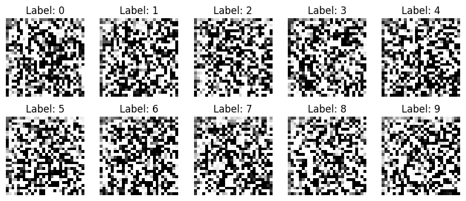
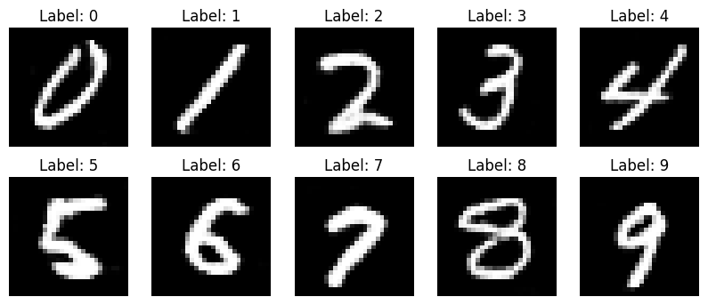
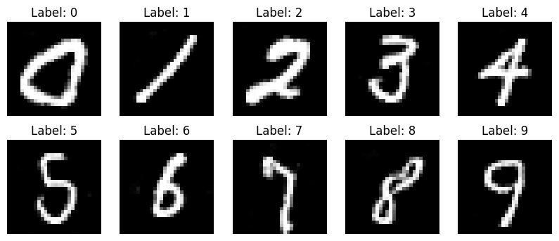
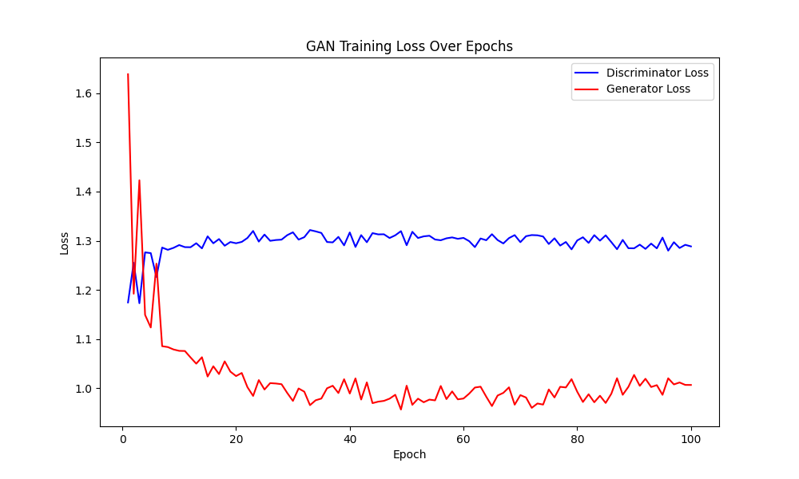
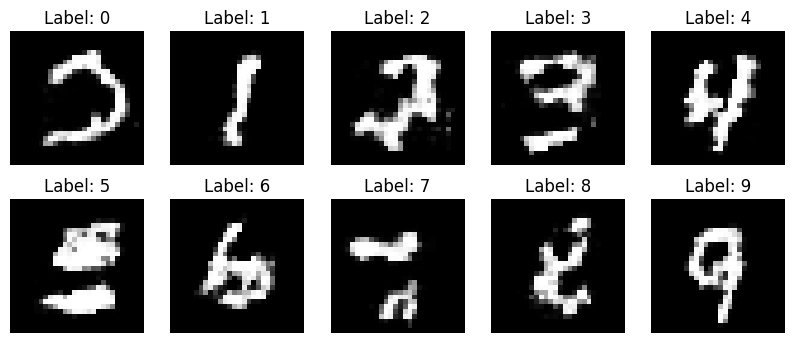

# cGAN MNIST Handwritten Digit Generation

English  /  [中文](readme_zh.md)

↑ 点击切换语言

This project leverages the **cGAN** framework to improve image generation quality using convolutional neural networks, enabling the generator to create images conditioned on specific labels.

Compared to traditional GAN frameworks, cGAN achieves category control and significantly enhances the quality and diversity of generated samples.

The three images below display the generated images at the start of training, after 50 epochs, and at the end of training.

**Before Training**



**Epoch 50**



**Epoch 100**



The plot below shows the changing trends in **discriminator loss** and **generator loss** throughout the training process.



**Limitations of Embedding Layers with Sparse Labels**

In the initial experiments, I used an embedding layer to represent label information, expecting the generator to leverage these embedded vectors to accurately produce images for each category. However, things didn’t go as planned. Below are the images generated using labels represented by the embedding layer.



**Explanation:**

When labels are sparse, embedding layers fail to provide explicit representations.

For relatively simple tasks, the model doesn’t require extra abstraction to interpret labels. Since embeddings don’t provide a straightforward representation, the model often confuses label information with image features. In other words, when the data is too simple, the model becomes “lazy” and cannot effectively differentiate implicit representations from the embedding layer. Therefore, one-hot encoding is needed to embed label information in a more direct way.

If the task is complex, embeddings can act similarly to one-hot encoding. Although less explicit, the model will interpret the embedding representation “diligently” due to the more complex data features.

## Table of Contents

- [Multilingual Annotations](#multilingual-annotations)
- [Dataset](#dataset)
- [File Structure](#file-structure)
- [License](#license)
- [Contributions](#contributions)

## Multilingual Annotations

To make the code more accessible to developers from different language backgrounds, this project includes both English and Chinese annotations.

## Dataset

The dataset used in this project is the **MNIST** dataset, a classic dataset of handwritten digits widely used for training and testing machine learning and deep learning models.

You can download the MNIST dataset using the following methods:

- [MNIST](http://yann.lecun.com/exdb/mnist/)
- Load the MNIST dataset directly via popular deep learning frameworks.

In this project, we use the `datasets` module provided by `torchvision` to load the MNIST dataset directly.

## File Structure

The project's file structure is as follows:

```c++
MNIST_cGAN/
│
├── data/ 
│   └── MNIST (automatically downloaded at runtime)
│
├── images/ 
│   └── epoch_*.png
│
├── model/ 
│   ├── netD.pth
│   └── netG.pth
│
├── utils(en/zh)/
│   ├── dataloader.py
│   ├── discriminator.py
│   ├── generator.py
│   └── train.py
│
├── contrast.png
├── loss_plot.ipynb
├── loss_plot.png
├── mnist_train.csv
├── readme.md
└── main.py 
```

## License

This project uses the MIT license. For details, please refer to the [LICENSE](LICENSE) file.

## Contributions

All forms of contributions are welcome! Whether you report a bug or propose an idea, it is greatly appreciated!!
