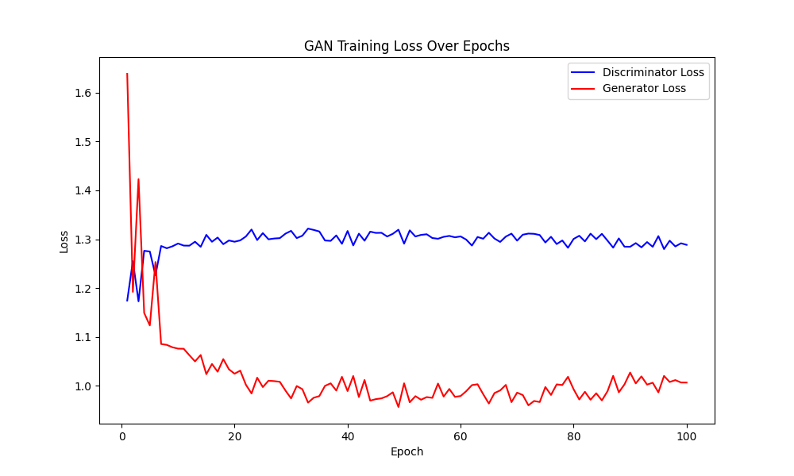

# cGAN MNIST手写数字生成

[English](readme_zh)  /  中文

↑ Click to switch language

本项目通过 **cGAN** 框架 使用卷积神经网络提升图像生成质量的同时 使生成器能够根据条件标签生成对应类别的图像

相比传统GAN框架 cGAN实现了类别控制 同时还显著提升了生成样本的质量与多样性

以下三张图片分别展示了训练开始前 第50轮 和训练结束时生成的图像

**开始前**


**第50轮**


**第100轮**


下图展示了该模型在训练过程中的 **判别器损失** 和 **生成器损失** 的变化趋势



**少量标签下嵌入层的局限性**

在最初的实验中 我使用嵌入层表示标签信息 认为生成器能够利用嵌入向量更精准的生成不同类别的图像 然而事与愿违 以下为使用嵌入层表示标签所生成的图像


**原因:** 

在少量标签的情况下 使用嵌入层表示的标签并不显式

也就是当训练任务相对简单时 模型并不需要额外的抽象来理解标签 因为标签表示不够直观 模型容易将标签信息与图像特征混淆,也就是数据过于简单导致模型 " 懒惰 " 无法有效判别出隐式的嵌入层表示 所以需要使用one-hot编码来进行直观的标签信息嵌入

如果任务复杂 嵌入层的抽象相当于one-hot的作用 虽然不显式 但模型会因复杂的数据特征而 “ 用心 ” 解读嵌入表示

## 目录

- [多语言注释](#多语言注释)
- [数据集](#数据集)
- [文件结构](#文件结构)
- [许可证](#许可证)
- [贡献](#贡献)

## 多语言注释

为了让不同语言背景的开发者更容易理解代码 本项目的注释提供了英文和中文两种版本

## 数据集

本项目使用的数据集为 **MNIST** 数据集 这是一个非常经典的手写数字数据集 广泛用于机器学习和深度学习模型的训练和测试

MNIST 数据集可以通过以下方式下载

- [MNIST](http://yann.lecun.com/exdb/mnist/)
- 通过常用的深度学习框架直接加载 MNIST 数据集

在本项目中使用了 `torchvision` 提供的 `datasets` 模块直接加载 MNIST 数据集

## 文件结构

项目的文件结构如下

```c++
MNIST_cGAN/
│
├── data/ 
│   └── MNIST(运行时自动下载)
│
├── images/ 
│   └── epoch_*.png
│
├── model/ 
│   ├── netD.pth
│   └── netG.pth
│
├── utils(en/zh)/
│   ├── dataloader.py
│   ├── discriminator.py
│   ├── generator.py
│   └── train.py
│
├── contrast.png
├── loss_plot.ipynb
├── loss_plot.png
├── mnist_train.csv
├── readme.md
└── main.py 
```

## 许可证

本项目使用 MIT 许可证。有关详细信息，请参阅 [LICENSE](LICENSE) 文件。

## 贡献

欢迎所有形式的贡献！无论是报告错误还是提出建议 非常感谢！！

